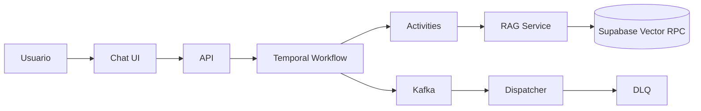
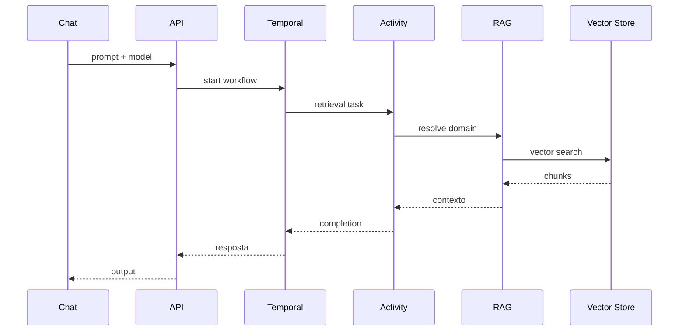

# Case Study — Plataforma conversacional multi-base

## Problema de sistema

A plataforma operava com múltiplos serviços (chat, workflows, infra, API OpenAI-compatible) e precisava:

- responder corretamente por domínio de conhecimento (GEPLA vs Governança)
- manter operação confiável em ambiente dev/prod-like
- autenticar via LDAP corporativo sem ambiguidade operacional

**Sintoma principal:** consultas GEPLA retornavam respostas genéricas mesmo com modelo correto selecionado no chat.

## Hipóteses investigadas

1. Quebra na propagação de `model` entre workflow → activity → serviço RAG
2. Drift entre código-fonte e wheel instalado no worker Temporal
3. RPC vetorial com credencial/permissão incorreta para base GEPLA

## Fluxo ponta a ponta



## Arquitetura backend

```mermaid
flowchart TB
  subgraph Client
    UI[Chat + LDAP]
  end
  subgraph API
    API
  end
  subgraph Orchestration
    TW[temporal-workflows]
    WK[Worker]
  end
  subgraph Data
    SB[(Supabase Vector)]
    PG[(PostgreSQL)]
    MG[(MongoDB)]
  end
  subgraph Messaging
    KF[Kafka]
    DLQ[DLQ]
  end
  UI --> API --> TW --> WK
  WK --> SB
  WK --> PG
  WK --> MG
  WK --> KF --> DLQ
```

## Pipeline assíncrono (sequência)



## Decisões arquiteturais

- Roteamento explícito por `model` com validação em log estruturado
- Fallback por assinatura para compatibilidade com workers legados
- Separação clara entre falha de aplicação e falha de infraestrutura
- DLQ para isolar mensagens irrecuperáveis sem contaminar o fluxo principal

## Tradeoffs

| Decisão | Ganho | Custo |
|---------|-------|-------|
| Logs detalhados por etapa | Debug mais rápido | Maior volume de telemetria |
| Rebuild de worker | Elimina drift runtime | Janela de redeploy |
| Compatibilidade retroativa | Menor risco em produção | Mais complexidade no código |

## O que eu faria em produção

- SLOs por etapa (ingestão, retrieval, completion, erro)
- Alertas em taxa de DLQ/fallback e mismatch de domínio
- Testes de contrato API ↔ workflow ↔ RPC vetorial
- Runbook de incidentes com árvore app vs infra

## Stack

Temporal, Python, Kafka, Docker Compose, Supabase (RPC + vector search), LDAP/AD, Node.js, MongoDB, API OpenAI-compatible.
